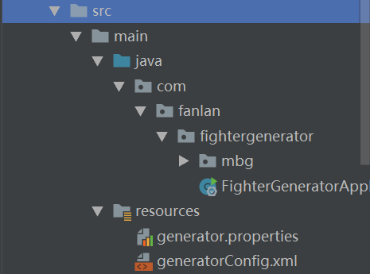

# 自动生产mapper and xml



### 需要修改的地方：

1.generator.properties 修改数据库位置

2.修改 generatorConfig.xml 以下位置：

- ```
  <commentGenerator type="com.fanlan.fightergenerator.mbg.CommentGenerator">
  ```

- ```
  <javaModelGenerator targetPackage="com.fanlan.fightergenerator.mbg.model" targetProject="fighter-generator\src\main\java"/>
  ```

- ```
  <sqlMapGenerator targetPackage="mapper" targetProject="fighter-generator\src\main\resources"/>
  ```

- ```
  <javaClientGenerator type="XMLMAPPER" targetPackage="com.fanlan.fightergenerator.mbg.mapper"
                       targetProject="fighter-generator\src\main\java"/>
  ```

- ```
  <table tableName="edu_subject">
  ```